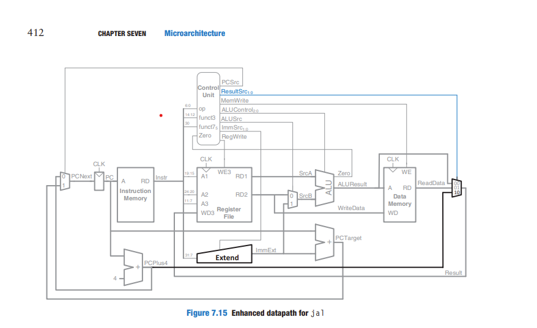

# Risc-V
Single Cycle MIPS Processor
## Introduction
The Single Cycle MIPS Processor is a simplified processor architecture that executes instructions in a single clock cycle. It follows the MIPS (Microprocessor without Interlocked Pipeline Stages) instruction set architecture. This implementation provides a basic understanding of how instructions are fetched, decoded, and executed in a simple pipeline.

Overview
The processor supports a variety of instructions, including arithmetic, logical, load/store, and branch instructions. It processes these instructions sequentially, each in a single clock cycle, making it straightforward but relatively slow compared to more complex pipelined architectures.

## Features
Single Cycle Execution: Each instruction is executed in a single clock cycle.
## Block Diagram

### Main Components:
* Arithmetic Logic Unit (ALU): Performs arithmetic and logical operations.
* Control Unit: Manages the flow of instructions and data.
* Register File: Stores data and intermediate results.
* Program Counter (PC): Keeps track of the memory address of the current instruction.
* RAM:stores and reads data by accessing it through address 
* ROM:stores the program we want to execute
* 

